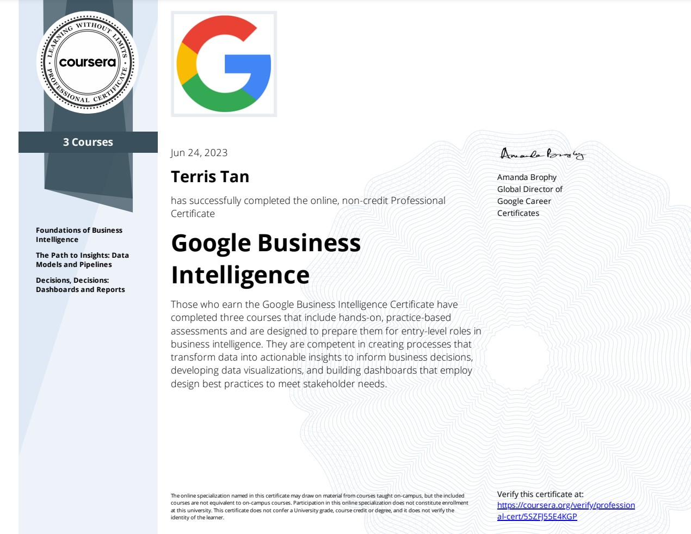

## [Google Business Intelligence Professional Certificate](https://www.coursera.org/professional-certificates/google-business-intelligence)

 

 

### About this Professional Certificate

Get professional training designed by Google and take the next step in your career with advanced skills in the high-growth field of business intelligence. There are over 166,000 open jobs in business intelligence and the median salary for entry-level roles is $96,000.¹

Business intelligence professionals collect, organize, interpret, and report on data to help organizations make informed business decisions. Some responsibilities include measuring performance, tracking revenue or spending, and monitoring progress.

This certificate builds on your data analytics skills and experience to take your career to the next level. It's designed for graduates of the Google Data Analytics Certificate or people with equivalent data analytics experience. Expand your knowledge with practical, hands-on projects, featuring BigQuery, SQL, and Tableau.

After three courses, you’ll be prepared for jobs like business intelligence analyst, business intelligence engineer, business intelligence developer, and more. At under 10 hours a week, the certificate program can be completed in less than two months. Upon completion, you can apply for jobs with Google and over 150 U.S. employers, including Deloitte, Target, and Verizon.

---

### Applied Learning Project

This program includes over 70 hours of instruction and 50+ practice-based assessments, which will help you simulate real-world business intelligence scenarios that are critical for success in the workplace. The content is highly interactive and exclusively developed by Google employees with decades of experience in business intelligence. Through a mix of videos, assessments, and hands-on labs, you’ll get introduced to BI tools and platforms and key technical skills required for an entry-level job.

**Platforms and tools you will learn include:** BigQuery, SQL, Tableau

In addition to expert training and hands-on projects, you'll complete a portfolio project that you can share with potential employers to showcase your new skill set. Learn concrete skills that top employers are hiring for right now.

---

## What you will learn

- Explore the roles of business intelligence (BI) professionals within an organization
- Practice data modeling and extract, transform, load (ETL) processes that meet organizational goals
- Design data visualizations that answer business questions
- Create dashboards that effectively communicate data insights to stakeholders

---

## Skills you’ll gain:

|       <!-- -->        |             <!-- -->             |          <!-- -->          |     <!-- -->     |           <!-- -->           |
| :-------------------: | :------------------------------: | :------------------------: | :--------------: | :--------------------------: |
|     Data Modeling     |        Business Analysis         |          Bigquery          |      Sheets      |        Data Analysis         |
|      Extraction       | Transformation And Loading (ETL) |      Business Process      | Tableau Software | Data Visualization (DataViz) |
| Business Intelligence |               SQL                | Dashboarding and Reporting |                  |                              |
